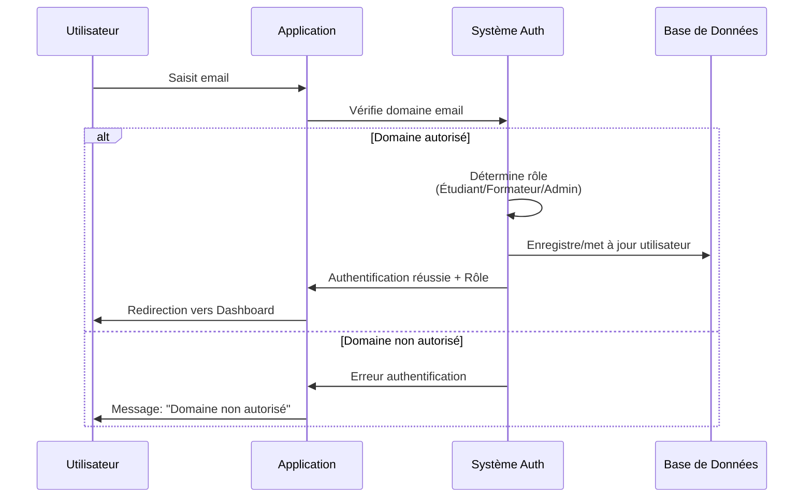
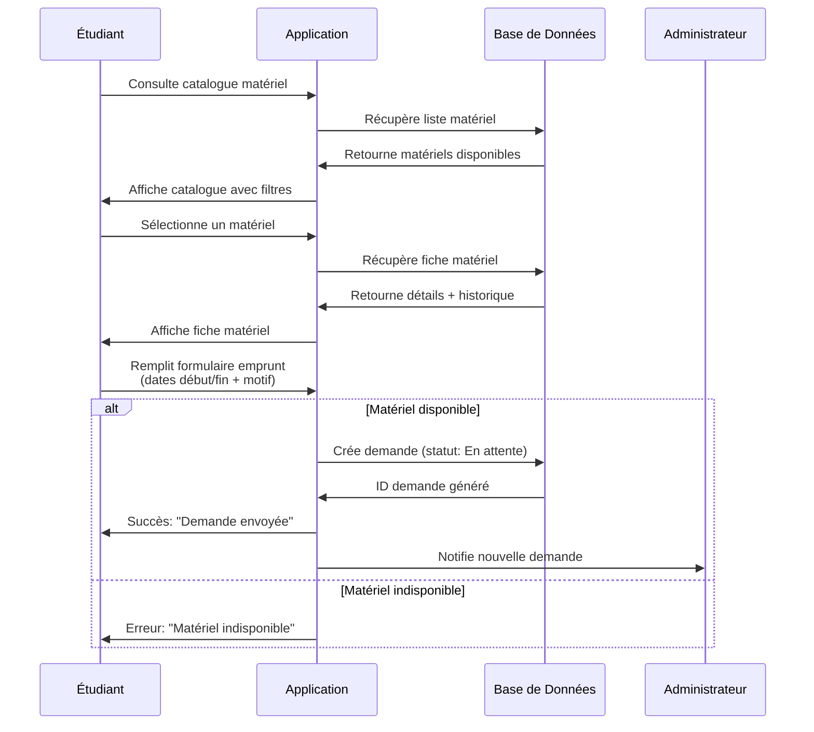
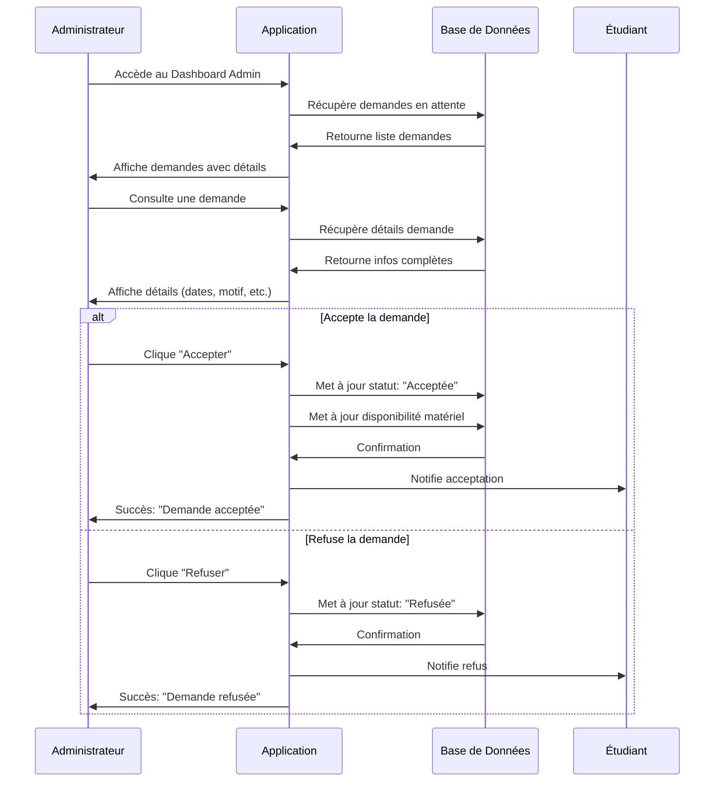
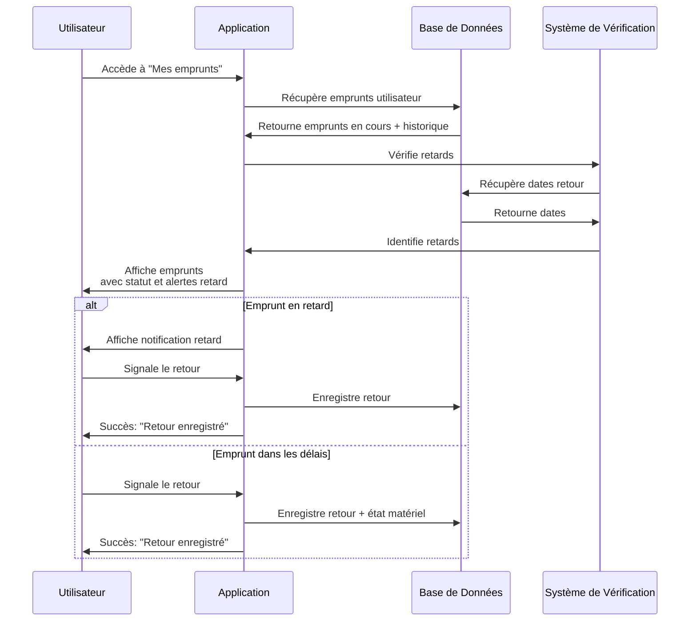
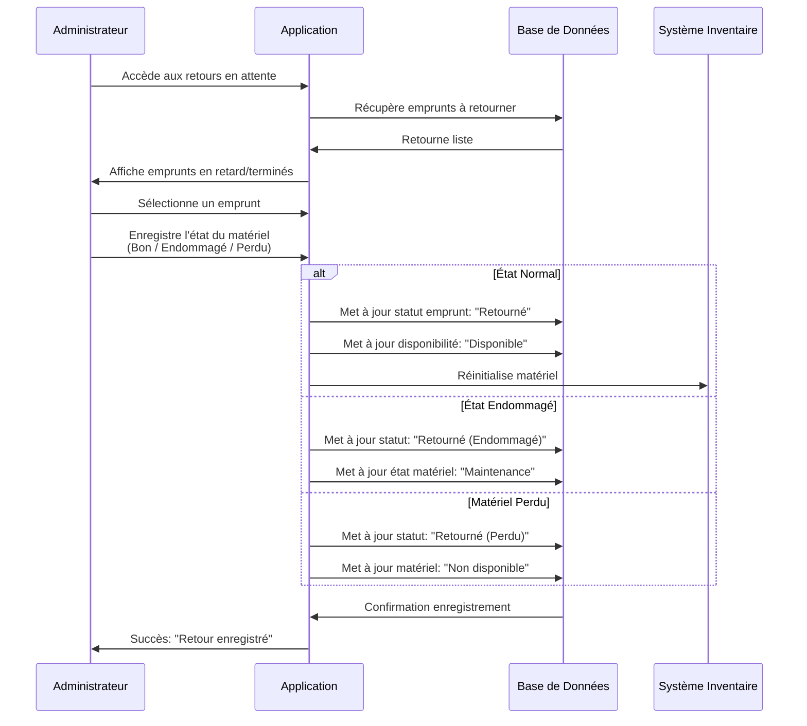
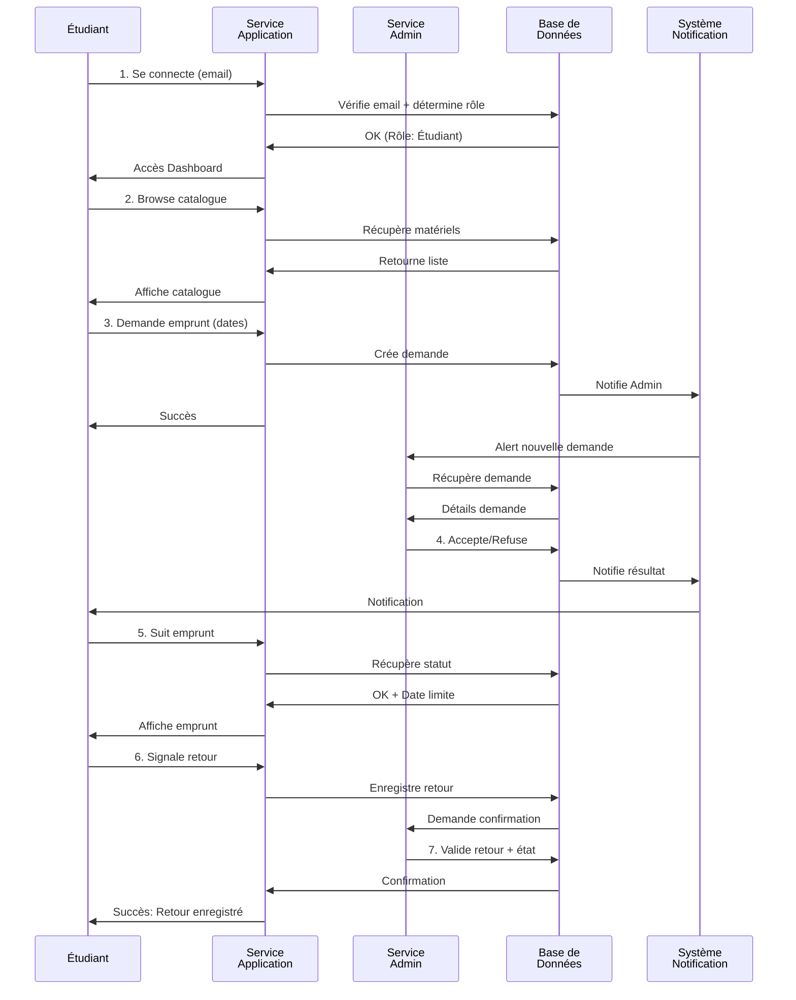

# Diagrammes de Séquence - MyDil-Model-EPSI

## 1. Flux d'Authentification

## 2. Flux de Demande d'Emprunt (Étudiant)

## 3. Flux de Validation de Demande (Administrateur)

## 4. Flux de Suivi d'Emprunt (Utilisateur)

## 5. Flux de Gestion des Retours (Administrateur)

## 6. Flux Complet (Vue Macroscopique)

